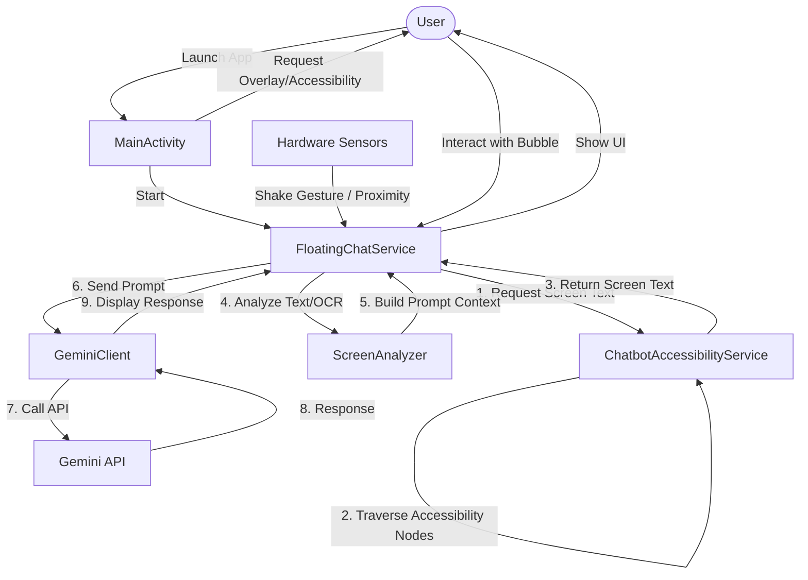

# 🤖 AI Screen Assistant Chatbot

[](https://developer.android.com/)
[](https://kotlinlang.org/)
[](https://aistudio.google.com/)
[](https://opensource.org/licenses/MIT)

An advanced, futuristic screen-aware Android chatbot that "sees" what is on your screen and provides AI-powered assistance using **Google Gemini 3.1 Flash**. Engineered with Jetpack Compose, Android Foreground Services, and hardware sensor integration to deliver a premium, overlay-based assistant experience.

---

## 📸 App Interface Mockup

Below is a design mockup of the glassmorphic floating chat interface in action:


*(To view project logs and assets, explore the assets directory)*

---

## ✨ Features

- 🔍 **Real-time Screen Awareness**  
  Utilizes the **Android Accessibility Service API** to extract structural text and content descriptors from active applications.  
  *Source from github*
- 📸 **On-Demand OCR Analysis**  
  Integrated with **Google ML Kit Text Recognition** for extracting text from visual assets and graphical elements on your screen.  
  *Done by Kritika Siraswa*
- 🛸 **Glassmorphic Floating Overlay**  
  Built with **Jetpack Compose**, displaying a floating overlay bubble that stays active on top of other apps, allowing seamless multitasking.  
  *Done by Kritika Siraswa*
- 🫨 **Accelerometer Shake Trigger**  
  Monitors physical device movement via hardware sensors; simply shake the phone to instantly wake the assistant and analyze the active screen.  
  *Source from github*
- 🖐️ **Proximity Privacy Hide**  
  Cover the top of the phone (proximity sensor) to instantly minimize the chatbot window, keeping your conversations private.  
  *Done by Kritika Siraswa*
- ⚡ **Gemini 3.1 Flash Integration**  
  Uses Google’s state-of-the-art Generative AI SDK with optimized parameters (temperature, topK, topP) for lightning-fast responses.  
  *Done by Kritika Siraswa*


---

## 🗺️ System Architecture

The diagram below illustrates how components interact to retrieve, analyze, and generate responses based on your active screen content:



---

## 🛠️ Technology Stack

- **UI Framework:** Jetpack Compose (Material 3)
- **AI/ML Engine:** Google Generative AI SDK (Gemini API) & Google ML Kit Vision (Text Recognition)
- **Background Processes:** Android Foreground Services & Android Lifecycle Services
- **Sensors:** Android `SensorManager` (Accelerometer & Proximity Sensors)
- **Concurrency & Streams:** Kotlin Coroutines & Flow API
- **Minimum SDK:** Android API 26 (Oreo)
- **Target SDK:** Android API 35 (Android 15)

---

## 🚀 Getting Started

### Prerequisites

1. **Android Studio** Ladybug (2024.2.1) or newer.
2. **Google AI Studio Key** — Obtain an API key from [Google AI Studio](https://aistudio.google.com/app/apikey).
3. **Android Device / Emulator** running Android API 26+ with Google Play Services enabled.

### Setup Instructions

1. **Clone the repository:**
   ```bash
   git clone https://github.com/your-username/Chatbot.git
   ```
2. **Import the project:**
   Open Android Studio and import the cloned folder as an existing Gradle project.
3. **Add your Gemini API Key:**
   Open [FloatingChatService.kt](file:///c:/Users/91842/AndroidStudioProjects/Chatbot/app/src/main/java/com/example/chatbot/service/FloatingChatService.kt#L75) and configure your API key:
   ```kotlin
   private val API_KEY = "YOUR_API_KEY_HERE"
   ```
   > [!NOTE]
   > For production deployments, it is recommended to store your API key securely inside local properties or build variables instead of hardcoding.
4. **Build and Run:**
   Connect your physical device or launch an emulator, then click **Run 'app'**.

---

## 📖 How to Use

Follow these steps to unlock the screen-aware assistant:

```
┌────────────────────────┐     ┌────────────────────────┐     ┌────────────────────────┐
│  1. Grant Permissions  │ ──> │  2. Turn Accessibility │ ──> │ 3. Start Chatbot Serv. │
│   Display Over Apps    │     │   Find 'Chatbot' & ON  │     │  Cyan bubble appears   │
└────────────────────────┘     └────────────────────────┘     └────────────────────────┘
```

1. **Overlay Permission**: On first launch, grant the "Display over other apps" permission.
2. **Accessibility Access**: Click **Enable Accessibility**, locate **Chatbot** in your Android Accessibility service list, and toggle it to **ON**.
3. **Start Service**: Click the **Start Chatbot Service** button in the main screen. A floating cyan chat bubble will appear.
4. **Interact**:
   - **Open/Analyze**: Tap the floating bubble, or **shake your phone** while viewing any app.
   - **Type**: Input text in the Chat Screen to ask questions about the analyzed screen context.
   - **Minimize**: Tap the close icon, or **cover the proximity sensor** (top of your phone) for instant privacy.

---

## 📂 Project Directory Structure

```yaml
app/src/main/java/com/example/chatbot/
├── ai/
│   ├── GeminiClient.kt      # Interface to Google Generative AI (Gemini 3.1 Flash Lite)
│   └── ScreenAnalyzer.kt    # Combines Accessibility Tree Nodes and OCR Text
├── data/
│   └── ChatMessage.kt       # Data model representing a message in the chat
├── service/
│   ├── ChatbotAccessibilityService.kt  # Extracts text recursively from active screen
│   └── FloatingChatService.kt         # Foreground overlay service, coordinates UI & sensors
├── ui/
│   ├── theme/               # Color, Typography, and Theme specifications
│   ├── ChatScreen.kt        # Compose chat messages layout
│   └── FloatingChatUI.kt    # Compose floating bubble and overlay sheet UI
└── MainActivity.kt          # Host activity for permissions and setup instructions
```

---

## 🔮 Future Enhancements

- [ ] **Room DB Chat History**: Persist chat threads and screen analyses locally.
- [ ] **MediaProjection Screen Capture**: Capture exact high-quality visual screenshots to support multimodal image analysis in addition to accessibility text.
- [ ] **Contextual App Action Executions**: Allow the assistant to perform simple UI actions (tapping buttons, filling fields) on behalf of the user using the Accessibility Service.
- [ ] **Multi-turn Chat Memory**: Upgrade state management to support full conversation memory with systemic prompts.

---

## ⚖️ License

Distributed under the MIT License. See `LICENSE` for details.

---
*Created as a futuristic, screen-aware AI assistant experiment.*
